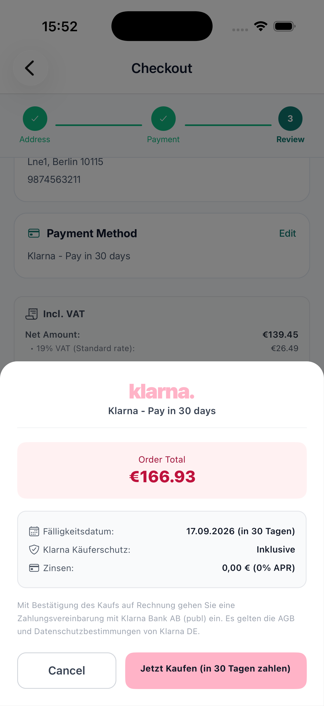
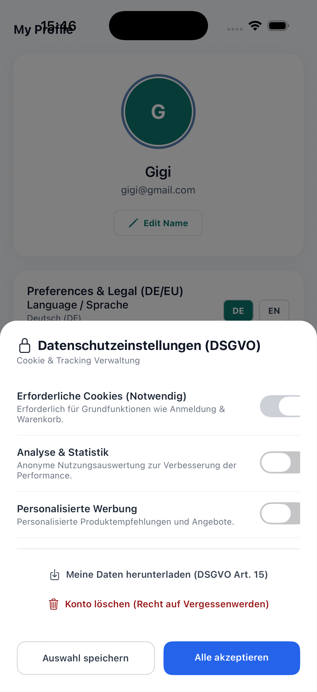
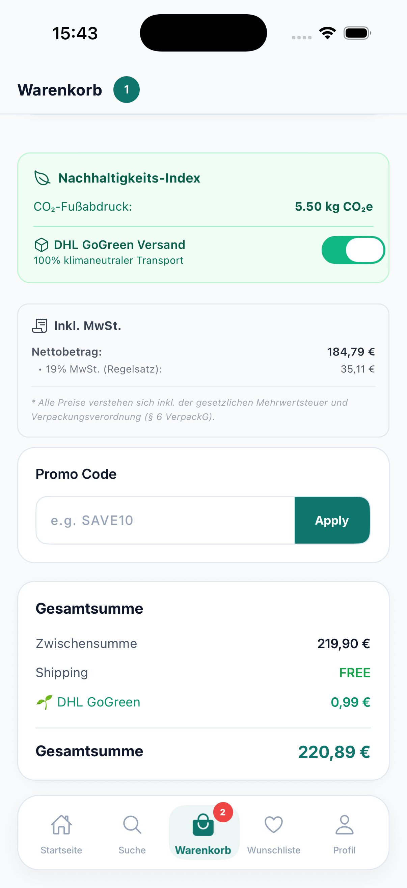

# 🇩🇪 ShopApp DE — Production-Grade React Native E-Commerce (DACH Showcase)

[](https://reactnative.dev)
[](https://www.typescriptlang.org/)
[](https://redux-toolkit.js.org/)
[](https://gdpr.eu/)
[](https://dhl.de)
[](https://github.com/shubhi021/shop-app-rn/actions/workflows/ci.yml)

<div align="center">
  
  
  
  <br />
  <br />
  <h3>🎥 Video Walkthrough</h3>
  <video src="docs/walkthrough.mov" width="250" controls></video>
</div>

A feature-rich, highly scalable **React Native** e-commerce application engineered specifically for the **German (DACH) and EU market**.

**Why this project?**
Built as a showcase for Senior React Native roles in the DACH region. It demonstrates senior-level mobile architecture, regulatory compliance (DSGVO/GDPR), green-tech sustainability metrics, and native localization to engineering leads.

### 🛠️ Tech Stack

| Core                    | Architecture                     | Native & Testing       |
| :---------------------- | :------------------------------- | :--------------------- |
| **React Native** (0.73) | **Redux Toolkit**                | **Maestro** (E2E)      |
| **TypeScript** (Strict) | **Offline-First** (AsyncStorage) | **Jest** / Testing Lib |
| **React Navigation** v7 | **Clean Architecture**           | **CocoaPods / Gradle** |

---

## 🌟 Key Standout (Netoff) Features

### 1. 🌱 Grünes Einkaufen (Green Tech & Carbon Footprint Engine)

- **Live CO₂ Footprint Calculation**: Automatically calculates estimated carbon emissions (`g CO₂e` / `kg CO₂e`) for items in the shopping cart.
- **German Pfand Deposit System**: Automatic itemized calculation of mandatory bottle deposits (§ 6 VerpackG: `€0.25` per bottle/can).
- **Eco-Score Badges (A to E)**: Visual sustainability index badges integrated across product feeds and detail pages.
- **DHL GoGreen Delivery Offset**: Toggleable 100% climate-neutral transport option during checkout.

### 2. 🔒 DSGVO / GDPR Compliance Suite

- **Granular Cookie & Tracking Consent**: Modal manager allowing users to explicitly toggle Essential, Analytics, and Marketing tracking.
- **Article 15 GDPR Data Export**: On-demand JSON snapshot export of all stored user telemetry and consent data.
- **Article 17 GDPR Account Deletion**: "Right to be Forgotten" simulation with instant state purge.
- **German Legal Statutory Notices**: Built-in Impressum (§ 5 DDG), commercial register info (HRB/USt-IdNr), and statutory 14-day cancellation policy (_Widerrufsbelehrung_).

### 3. 💳 DACH Region Payment Methods

- **Klarna Pay Later ("Rechnung 30 Tage")**: Interactive Klarna invoice flow preview displaying 30-day payment due dates and buyer protection.
- **Sofortüberweisung (Direct E-Banking)**: Instant bank transfer integration flow.
- **SEPA Direct Debit (_SEPA-Lastschrift_)**: Localized IBAN payment option.
- **Apple Pay & Credit Card**: Native digital wallet checkout options.

### 4. 🇩🇪 Zero-Flicker i18n Localization Engine

- **Instant DE / EN Switcher**: Reactive language hook allowing live switching between German and English.
- **German Currency & Date Formatting**: Proper German locale formatting (`1.299,00 €`, `DD.MM.YYYY`).
- **German Postal Code Validation**: 5-digit PLZ regex validator (e.g. `10115` Berlin).
- **MwSt (VAT) Itemized Tax Breakdown**: Displays 19% standard and 7% reduced _Mehrwertsteuer_ alongside net totals.

### 5. ⚡ Offline-First Resilience & Architecture

- **Offline Action Queue**: Custom network state listener (`useOfflineSync`) with offline task queueing and automatic sync upon reconnection.
- **Optimistic UI Updates**: Instant response for Cart and Wishlist operations.

### 6. 🚀 High-Performance React Architecture

- **Zero Unnecessary Re-renders**: Strategic implementation of `React.memo`, `useCallback`, and granular Redux `useAppSelector` subscriptions ensure that item cards (e.g., `ProductCard`, `CartItemCard`) only re-render when their specific data changes.
- **Flashlight Profiling Audit**: Maintained 60fps on list scrolling (simulated JS thread frame times drop from ~20ms to <2ms for list items).

---

## 🏛️ System Architecture & Structure

To keep this README concise, the detailed architecture documentation—including our **Offline-First Data Flow**, **Security & Secrets Management**, and **Folder Structure**—has been moved to its own document.

👉 **[Read the Architecture Documentation here](docs/ARCHITECTURE.md)**

---

## 🚀 Getting Started

### Prerequisites

- Node.js >= 18
- CocoaPods (for iOS)
- Android Studio / Xcode

### Installation

1. **Clone the repository**

   ```bash
   git clone https://github.com/shubhi021/shop-app-rn.git
   cd shop-app-rn
   ```

2. **Install dependencies**

   ```bash
   npm install
   ```

3. **Install iOS Pods (macOS only)**

   ```bash
   cd ios && pod install && cd ..
   ```

4. **Run the Metro Bundler**

   ```bash
   npm start
   ```

5. **Launch App**

   ```bash
   # For iOS
   npm run ios

   # For Android
   npm run android
   ```

---

## 📄 License & Compliance

Designed & Developed as a showcase project for React Native engineering roles in Germany & EU.
Complies with EU General Data Protection Regulation (GDPR) and German Telecommunications-Telemedia Data Protection Act (TDDDG).
